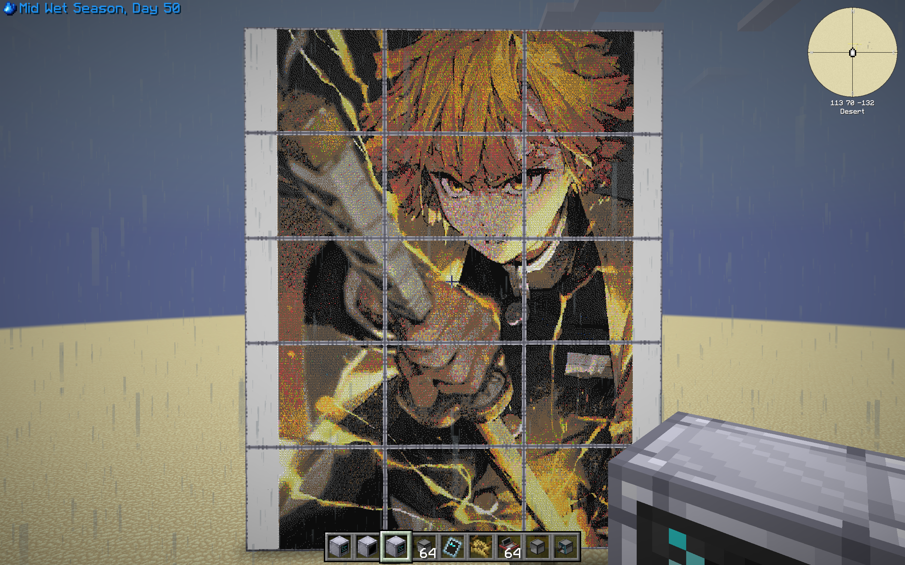
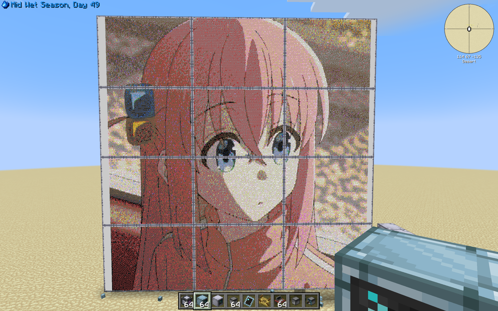
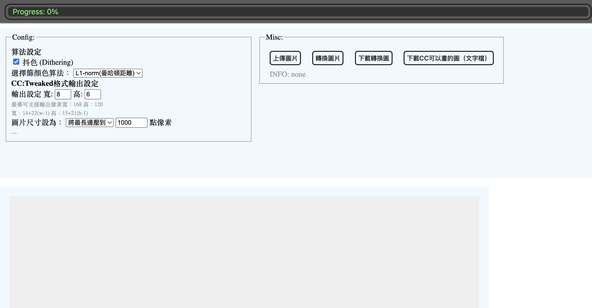
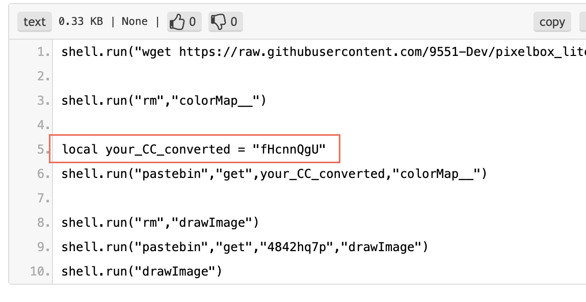

# CC:Tweaked圖片轉換器 使用手冊

CC:Tweaked內建的Lua method `paintutils.drawImage` 並不支援繪畫常見的圖像格式，其內的螢幕也只支援16色，阻礙了我們「想在CC:Tweaked的弱雞螢幕畫上自己心目中的動漫靚男靚女」的意志。

這個工具為了解決上述問題並推動該意志而存在。

## 效果演示

## 使用方法

> 本段假設讀者知曉[Pastebin](https://pastebin.com/)，以及他的功能。簡單來說，這是一個好學（30分鐘內學得會）的免註冊程式碼分享區。

打開介面，可以先設定輸出尺寸，使得實際在畫圖時不會超出螢幕範圍。左方Config、第五行的輸出設定，可以在此輸入自己的螢幕尺寸，下方灰字就會顯示螢幕可支援的像素寬、高。

一切設定完，便可以將圖片上傳。這之後，圖片就會開始被轉換。轉換完成後，點右邊第四個按鈕，即可複製一段代表該圖的字串，這些字串符會在之後被Lua腳本解釋成一個個像素。

將這個解貼簿中的字串符貼上[Pastebin](https://pastebin.com/)上，克隆這個pastebin:<https://pastebin.com/srrXagT6>

克隆後，如果字串符的pastebin網址為https://pastebin.com/*AABBCCDD*，就請把下圖中`your_CC_converted`的值設為*AABBCCDD*，依樣畫葫蘆。最後保存這個pastebin

最後，將computer放到monitor的**前面**，而且**computer 要背向大monitor**。
如果剛剛克隆的pastebin保存後的網址為https://pastebin.com/*1919810*，那就在computer的terminal執行`pastebin run 1919810`，等待三秒後，即可在螢幕上看到圖片，再把電腦敲掉即可。

此時如果想換圖片輸出，只要更改https://pastebin.com/*AABBCCDD* 的檔案內容，並一樣在computer執行`pastebin run 1919810`即可。

如果你的螢幕是多個8ㄨ6組成的陣列，推薦使用<https://imagestool.com/zh_TW/resize-images>（無業配）來預先調尺寸並分割圖片到多份尺寸為168ㄨ120的子圖，方便批量處理。

## 注意事項

* advanced monitor才有16色，所以請用它，否則會被轉成灰色調！

* 但是，在此沒有必要用advanced computer

* 執行pastebin run後，約需要4秒，monitor才會出現東西。請勿在這之前打掉computer，否則無反應。

## SHOUTOUT
Shoutout to 開發這個專案的人https://github.com/9551-Dev/pixelbox_lite

這個大神不知道用了什麼黑魔法寫的這個Lua套件，可以把CC螢幕的解析度暴漲六倍之多。沒有上面大佬寫出來的套件就沒有這個專案。